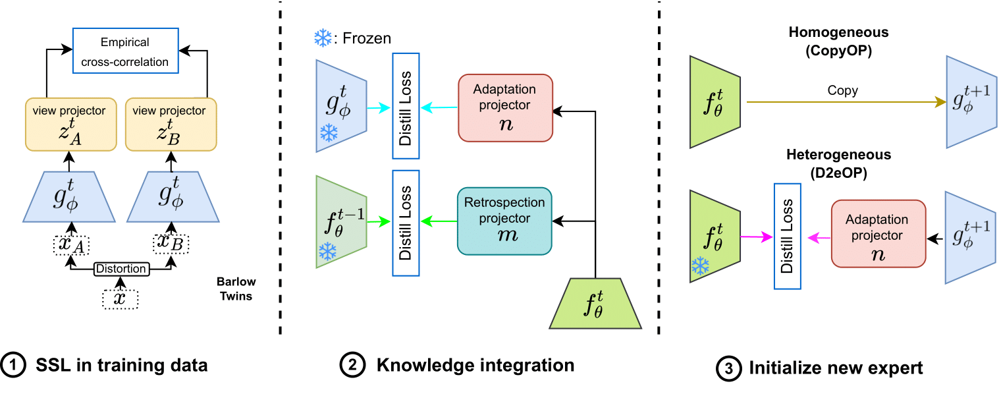

 # Plasticity-Optimized Complementary Networks for Unsupervised Continual Learning

This is the official repository for the paper:
> **[Plasticity-Optimized Complementary Networks for Unsupervised Continual Learning](https://arxiv.org/abs/)**<br>
> [Alex Gomez-Villa](https://scholar.google.com/citations?user=A2dhwNgAAAAJ&hl=en), [Bartlomiej Twardowski](https://scholar.google.com/citations?user=8yywECgAAAAJ&hl), [Kai Wang](https://scholar.google.com/citations?user=j14vd0wAAAAJ&hl), [Joost van de Weijer](https://scholar.google.com/citations?user=Gsw2iUEAAAAJ&hl)<br>
> **WACV 2024**

> **Abstract:** *Continuous unsupervised representation learning (CURL) research has greatly benefited from improvements in self-supervised learning (SSL) techniques.  As a result, existing CURL methods using SSL can learn high-quality representations without any labels, but with a notable performance drop when learning on a many-tasks data stream.
We hypothesize that this is caused by the regularization losses that are imposed to prevent forgetting, leading to a suboptimal plasticity-stability trade-off: they either do not adapt fully to the incoming data (low plasticity), or incur significant forgetting when allowed to fully adapt to a new SSL pretext-task (low stability). In this work, we propose to train an expert network that is relieved of the duty of keeping the previous knowledge and can focus on performing optimally on the new tasks (optimizing plasticity). In the second phase, we combine this new knowledge with the previous network in an adaptation-retrospection phase to avoid forgetting and initialize a new expert with the knowledge of the old network. We perform several experiments showing that our proposed approach outperforms other CURL exemplar-free methods in few- and many-task split settings. Furthermore, we show how to adapt our approach to semi-supervised continual learning (Semi-SCL) and show that we surpass the accuracy of other exemplar-free Semi-SCL methods and reach the results of some others that use exemplars.*
<br>

<p align="center" float="left">
     
    
</p>

**This code will be refactored, I am moving all the code inside the [CaSSLe](https://github.com/DonkeyShot21/cassle) framework. Currently, you can train and evaluate using the CopyOP (The method used in the paper tables). Note that TinyImagenet and ImageNet100 are also available but the runtime is extremely slow, the refactored version will be faster.**


# TL;DR
If you are trying to replicate this method inside your code or just want to find the core training parts look for:
- [src/approach/copyOPscratch.py](https://github.com/alviur/pocon_wacv2024/blob/main/src/approach/copyOPscratch.py): trains a ResNet18 from scratch using the copyOP approach
- [src/approch/sslModels.py](https://github.com/alviur/pocon_wacv2024/blob/main/src/approach/sslModels.py) : contains core classes (SSL and CL) and functions of the POCON method
- [src/main_incremental.py](https://github.com/alviur/pocon_wacv2024/blob/main/src/main_incremental.py) : Data split and task control

# Setup conda

```
CUDA_VER=$(cat /usr/local/cuda/version.txt | cut -d' ' -f 3 | cut -c 1-4)
echo $CUDA_VER

# For new cuda varsion file is JSON
# CUDA_VER=11.0

conda update -n base -c defaults conda
conda create -n cvc-class-il python=3.8
conda activate cvc-class-il
conda install -y pytorch torchvision cudatoolkit=$CUDA_VER -c pytorch
conda install -y pytorch-metric-learning -c metric-learning -c pytorch
pip install -U pip
pip install tensorflow-gpu tensorboard

```
## Class-incremental Training
### CIFAR100
E.g. running Barlow Twins copyOP:
```
pytest src/tests/wacv.py
```

## Linear Evaluation
For linear evaluation:
```
pytest src/tests/linear_prob.py
```

## No task boundary setting

Please replace main_incremental.py for [main_incremental_no_task_boundary.py](https://github.com/alviur/pocon_wacv2024/blob/main/src/main_incremental_no_task_boundary.py)

# Logging
Logging is performed with [WandB](https://wandb.ai/site). 
# Citation
If you like our work, please cite our [paper](https://arxiv.org/):
```
@inproceedings{gomezvilla2024,
  title={Plasticity-Optimized Complementary Networks for Unsupervised Continual Learning},
  author={Gomez-Villa, Alex and Twardowski, Bartlomiej and Wang, Kai and van de Weijer, Joost},
  booktitle={IEEE/CVF Winter Conference on Applications of Computer Vision},
  year={2024}
}